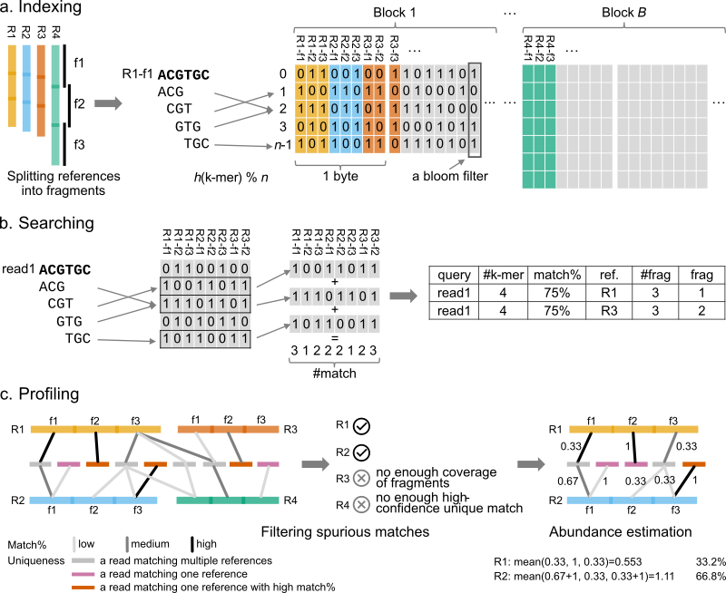

# KMCP - K-mer-based Metagenomics Classification and Profiling

Tutorials and resources:

- [Installation](https://bioinf.shenwei.me/kmcp/download)
- [Databases](https://bioinf.shenwei.me/kmcp/database)
- Tutorials
    - [Taxonomic profiling](https://bioinf.shenwei.me/kmcp/tutorial/profiling)
    - [Sequence and genome searching](https://bioinf.shenwei.me/kmcp/tutorial/searching)
- [Usage](https://bioinf.shenwei.me/kmcp/usage)
- [Benchmarks](https://bioinf.shenwei.me/kmcp/benchmark)
- [FAQs](https://bioinf.shenwei.me/kmcp/faq)

## Installation

Download [executable binaries](https://github.com/shenwei356/kmcp/releases),
or install using conda:

    conda install -c bioconda kmcp

## Quick Start

    # compute k-mers
    kmcp compute -k 21 --split-number 10 --split-overlap 100 \
        --in-dir genomes/ --out-dir genomes-k21-n10

    # index k-mers
    kmcp index --in-dir genomes-k21-n10/ --out-dir genomes.kmcp
    
    # delete temporary files
    # rm -rf genomes-k21-n10/
    
    # search    
    kmcp search --db-dir genomes.kmcp/ test.fa.gz --out-file search.tsv.gz

    # profile
    kmcp profile search.tsv.gz \
        --taxid-map        taxid.map \
        --taxdump          taxdump/ \
        --out-prefix       search.tsv.gz.k.profile \
        --metaphlan-report search.tsv.gz.m.profile \
        --cami-report      search.tsv.gz.c.profile

## Support

Please [open an issue](https://github.com/shenwei356/kmcp/issues) to report bugs,
propose new functions or ask for help.

## License

[MIT License](https://github.com/shenwei356/kmcp/blob/master/LICENSE)

## Credits

- [Zhi-Luo Deng](https://dawnmy.github.io/CV/) (Helmholtz Centre for Infection Research, Germany)
  gave many valuable advice on metagenomic profiling and benchmarking.
- [Robert Clausecker](https://github.com/clausecker/) (Zuse Institute Berlin, Germany)
  wrote the high-performance vectorized positional popcount package 
  ([pospop](https://github.com/clausecker/pospop)) 
  [during my development of KMCP](https://stackoverflow.com/questions/63248047/),
  which greatly accelerated bit-matrix searching.
