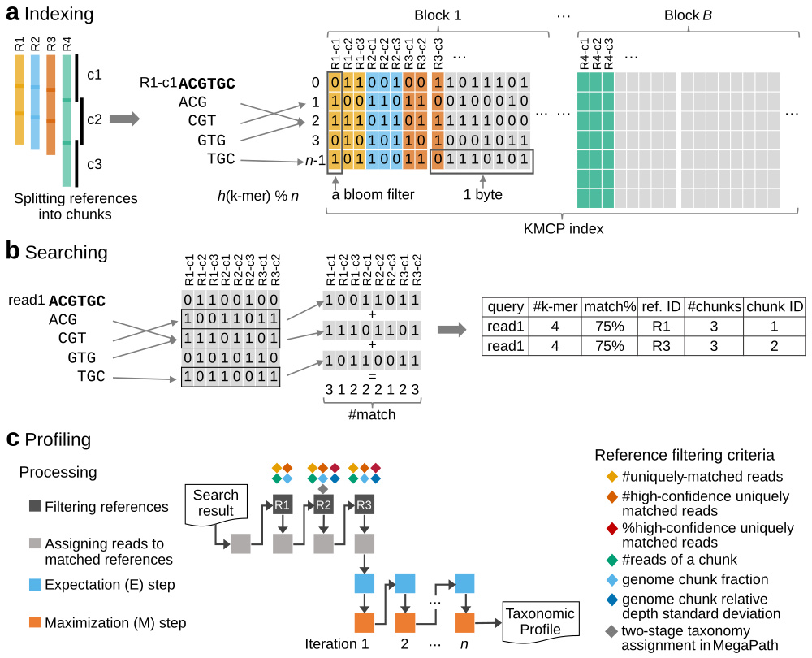

# KMCP: accurate metagenomic profiling of both prokaryotic and viral populations by pseudo-mapping

## Citation

> **KMCP: accurate metagenomic profiling of both prokaryotic and viral populations by pseudo-mapping**. 
> Wei Shen, Hongyan Xiang, Tianquan Huang, Hui Tang, Mingli Peng, Dachuan Cai, Peng Hu, Hong Ren. 
> Bioinformatics, btac845, [https://doi.org/10.1093/bioinformatics/btac845](https://doi.org/10.1093/bioinformatics/btac845)

## Table of contents

* [Documents](#documents)
* [What can we do?](#what-can-we-do-)
    + [1. Accurate metagenomic profiling](#1-accurate-metagenomic-profiling)
    + [2. Fast sequence search against large scales of genomic datasets](#2-fast-sequence-search-against-large-scales-of-genomic-datasets)
    + [3. Fast genome similarity estimation](#3-fast-genome-similarity-estimation)
* [Features](#features)
* [Installation](#installation)
* [Commands](#commands)
* [Quickstart](#quickstart)
* [KMCP vs COBS](#kmcp-vs-cobs)
* [Support](#support)
* [License](#license)
* [Acknowledgments](#acknowledgments)

## Documents

- [Installation](https://bioinf.shenwei.me/kmcp/download)
- [Databases](https://bioinf.shenwei.me/kmcp/database)
- Tutorials
    - [Taxonomic profiling](https://bioinf.shenwei.me/kmcp/tutorial/profiling)
    - [Sequence and genome searching](https://bioinf.shenwei.me/kmcp/tutorial/searching)
- [Usage](https://bioinf.shenwei.me/kmcp/usage)
- [Benchmarks](https://bioinf.shenwei.me/kmcp/benchmark)
- [FAQs](https://bioinf.shenwei.me/kmcp/faq)

## What can we do?

### 1. Accurate metagenomic profiling

KMCP utilizes genome coverage information by splitting the reference genomes
into chunks and stores k-mers in a modified and optimized [COBS](https://github.com/bingmann/cobs) index for
fast alignment-free sequence searching. KMCP **combines k-mer similarity and
genome coverage information to reduce the false positive rate** of k-mer-based
taxonomic classification and profiling methods.

The read mapping process in KMCP is referred to as **pseudo-mapping**,
which is similar to but different from the lightweight algorithm in Sailfish (Patro et al., 2014),
pseudoalignment in Kallisto (Bray et al., 2016), quasi-mapping in RapMap (Srivastava et al., 2016),
and lightweight mapping in Salmon (Patro et al., 2017). All of these methods seek to elide the
computation of base-to-base alignment using distinct strategies (Srivastava et al., 2016).
*In KMCP, each reference genome is pre-split into chunks of equal size, and the k-mers of a query,
as a whole, are compared to each genome chunk to find all possible ones sharing a predefined
proportion of k-mers with the query*. Like quasi-mapping in RapMap, KMCP tracks the target
and position for each query. However, the read position in KMCP is approximate and in a
predefined resolution (the number of genome chunks).

Benchmarking results based on simulated and real data demonstrate that **KMCP,
despite a longer running time than some other methods,
not only allows the accurate taxonomic profiling of prokaryotic and viral populations
but also provides more confident pathogen detection in clinical samples of low depth**.

***Genome collections with custom taxonomy***,
e.g., [GTDB](https://gtdb.ecogenomic.org/) uses its own taxonomy and
[MGV](https://doi.org/10.1038/s41564-021-00928-6) uses [ICTV taxonomy](https://talk.ictvonline.org/),
are also supported by generating NCBI-style taxdump files with [taxonkit create-taxdump](https://bioinf.shenwei.me/taxonkit/usage/#create-taxdump).
You can even [merge the GTDB taxonomy (for prokaryotic genomes from GTDB) and NCBI taxonomy (for genomes from NCBI)](https://bioinf.shenwei.me/kmcp/database/#merging-gtdb-and-ncbi-taxonomy).

### 2. Fast sequence search against large scales of genomic datasets

KMCP can be used for fast sequence search against large scales of genomic datasets
as [BIGSI](https://github.com/Phelimb/BIGSI) and [COBS](https://github.com/bingmann/cobs) do.
We reimplemented and modified the Compact Bit-Sliced Signature index (COBS) algorithm,
bringing a smaller index size and [much faster searching speed (2x for genome search and 10x for short reads) faster than COBS](https://bioinf.shenwei.me/kmcp/benchmark/searching/#result)
 (check the [tutorial](https://bioinf.shenwei.me/kmcp/tutorial/searching) and [benchmark](https://bioinf.shenwei.me/kmcp/benchmark/searching)). Also check [the algorithm and data structure differences between KMCP and COBS](#kmcp-vs-cobs).
 
### 3. Fast genome similarity estimation

KMCP can also be used for fast similarity estimation of assemblies/genomes against known reference genomes.

Genome sketching is a method of utilizing small and approximate summaries of
genomic data for fast searching and comparison.
[Mash](https://github.com/marbl/Mash) and [Sourmash](https://github.com/sourmash-bio/sourmash)
provide fast genome distance estimation using MinHash (Mash) or FracMinHash (Sourmash).
KMCP supports multiple k-mer sketches 
([Minimizer](https://academic.oup.com/bioinformatics/article/20/18/3363/202143), 
[FracMinHash](https://www.biorxiv.org/content/10.1101/2022.01.11.475838v2)
(previously named [Scaled MinHash](https://f1000research.com/articles/8-1006)), and
[Closed Syncmers](https://peerj.com/articles/10805/)) for genome similarity estimation.
And [KMCP is 5x-7x faster than Mash/Sourmash](https://bioinf.shenwei.me/kmcp/benchmark/searching/#result)
 (check the [tutorial](https://bioinf.shenwei.me/kmcp/tutorial/searching) and [benchmark](https://bioinf.shenwei.me/kmcp/benchmark/searching)).

## Features

- **Easy to install**
    - [Statically linked executable binaries for multiple platforms](https://bioinf.shenwei.me/kmcp/download) (Linux/Windows/macOS, AMD64/ARM64).
    - No dependencies, no configurations.
    - `conda install -c bioconda kmcp`
- **Easy to use**
    - Supporting [shell autocompletion](https://bioinf.shenwei.me/kmcp/usage/#autocompletion).
    - Detailed [usage](https://bioinf.shenwei.me/kmcp/usage), [database](https://bioinf.shenwei.me/kmcp/database),
      [tutorials](https://bioinf.shenwei.me/kmcp/tutorial), and [FAQs](https://bioinf.shenwei.me/kmcp/faq).
- **Building database is easy and fast**
    - [~25 min for 47894 genomes from GTDB-r202](https://bioinf.shenwei.me/kmcp/benchmark/searching/#kmcp-vs-cobs) on a sever with 40 CPU threads and solid disk drive.
- **Fast searching speed**
    - The index structure is modified from COBS, while [KMCP is 2x-10x faster](https://bioinf.shenwei.me/kmcp/benchmark/searching/#result) in sequence searching.
    - Automatically scales to exploit all available CPU cores.
    - Searching time is linearly related to the number of reference genomes (chunks).
- **Scalable searching**. *Searching results against multiple databases can be fast merged*.
    This brings many benefits:
    - *There's no need to re-built the database with newly added reference genomes*. 
    - The searching step can be parallelized with a computer cluster in which each computation node searches against a small database.
    - Computers with limited main memory can also utilize an extensive collection of reference genomes by building and searching against small databases..
- **Accurate taxonomic profiling**
    - Some k-mer based taxonomic profilers suffer from high false positive rates,
      while [KMCP adopts multiple strategies](https://bioinf.shenwei.me/kmcp/tutorial/profiling/#methods)
      to **improve specificity and keeps high sensitivity at the same time**.
    - In addition to archaea and bacteria, KMCP performed well on **viruses/phages**.
    - KMCP also provides **confident infectious pathogen detection**.
    - [Preset six modes for multiple scenarios](https://bioinf.shenwei.me/kmcp/tutorial/profiling/#profiling-modes).
    - [Supports CAMI and MetaPhlAn profiling format](https://bioinf.shenwei.me/kmcp/tutorial/profiling/#profiling-result-formats).
    

    

## Installation

Download [executable binaries](https://github.com/shenwei356/kmcp/releases),
or install using conda:

    conda install -c bioconda kmcp
    
SIMD extensions including `AVX512`, `AVX2`, `SSE2` are sequentially detected and used
in two packages for better searching performance.

- [pand](https://github.com/shenwei356/pand),
  for accelerating searching on databases constructed with multiple hash functions.
- [pospop](https://github.com/shenwei356/pospop/tree/short-input3),
  for batch counting matched k-mers in bloom filters.

ARM architecture is supported, but `kmcp search` would be slower.

## Commands

|Subcommand                                                                |Function                                                        |
|:-------------------------------------------------------------------------|:---------------------------------------------------------------|
|[**compute**](https://bioinf.shenwei.me/kmcp/usage/#compute)              |Generate k-mers (sketch) from FASTA/Q sequences                 |
|[**index**](https://bioinf.shenwei.me/kmcp/usage/#index)                  |Construct database from k-mer files                             |
|[**search**](https://bioinf.shenwei.me/kmcp/usage/#search)                |Search sequences against a database                             |
|[**merge**](https://bioinf.shenwei.me/kmcp/usage/#merge)                  |Merge search results from multiple databases                    |
|[**profile**](https://bioinf.shenwei.me/kmcp/usage/#profile)              |Generate taxonomic profile from search results                  |
|[utils split-genomes](https://bioinf.shenwei.me/kmcp/usage/#split-genomes)|Split genomes into chunks                                       |
|[utils unik-info](https://bioinf.shenwei.me/kmcp/usage/#unik-info)        |Print information of .unik file                                 |
|[utils index-info](https://bioinf.shenwei.me/kmcp/usage/#index-info)      |Print information of index file                                 |
|[utils ref-info](https://bioinf.shenwei.me/kmcp/usage/#ref-info)          |Print information of reference chunks in a database             |
|[utils cov2simi](https://bioinf.shenwei.me/kmcp/usage/#icov2simi)         |Convert k-mer coverage to sequence similarity                   |
|[utils query-fpr](https://bioinf.shenwei.me/kmcp/usage/#query-fpr)        |Compute the false positive rate of a query                      |
|[utils filter](https://bioinf.shenwei.me/kmcp/usage/#filter)              |Filter search results and find species/assembly-specific queries|
|[utils merge-regions](https://bioinf.shenwei.me/kmcp/usage/#merge-regions)|Merge species/assembly-specific regions                         |

## Quickstart

    # compute k-mers
    kmcp compute -k 21 --split-number 10 --split-overlap 150 \
        --in-dir genomes/ --out-dir genomes-k21-n10

    # index k-mers
    kmcp index --false-positive-rate 0.1 --num-hash 1 \
        --in-dir genomes-k21-n10/ --out-dir genomes.kmcp
    
    # delete temporary files
    # rm -rf genomes-k21-n10/
    
    # search    
    kmcp search --db-dir genomes.kmcp/ test.fa.gz --out-file search.kmcp@db1.kmcp.tsv.gz

    # merge search results against multiple databases
    kmcp merge -o search.kmcp.tsv.gz search.kmcp@*.kmcp.tsv.gz

    # profile and binning
    kmcp profile search.kmcp.tsv.gz \
        --taxid-map        taxid.map \
        --taxdump          taxdump/ \
        --out-prefix       search.tsv.gz.k.profile \
        --metaphlan-report search.tsv.gz.m.profile \
        --cami-report      search.tsv.gz.c.profile \
        --binning-result   search.tsv.gz.binning.gz

Next:

- [Demo of taxonomic profiling](https://github.com/shenwei356/kmcp/tree/main/demo-profiling)
- [Tutorial of taxonomic profiling](https://bioinf.shenwei.me/kmcp/tutorial/profiling)

## KMCP vs COBS

We reimplemented and modified the Compact Bit-Sliced Signature index ([COBS](https://github.com/bingmann/cobs)) algorithm,
bringing a smaller index size and [much faster searching speed (2x for genome search and 10x for short reads) faster than COBS](https://bioinf.shenwei.me/kmcp/benchmark/searching/#result).

The differences between KMCP and COBS

|Category       |Item                  |COBS                                 |KMCP                                                               |Comment                                                                                           |
|:--------------|:----------------------|:------------------------------------|:------------------------------------------------------------------|:-------------------------------------------------------------------------------------------------|
|Algorithm      |K-mer hashing          |xxhash                               |ntHash1                                                            |xxHash is a general-purpose hashing function while ntHash is a recursive hash function for DNA/RNA|
|               |Bloom filter hashing   |xxhash                               |Using k-mer hash values                                            |Avoid hash computation                                                                            |
|               |Multiple-hash functions|xxhash with different seeds          |Generating multiple values from a single one                       |Avoid hash computation                                                                            |
|               |Single-hash function   |Same as multiple-hash functions      |Separated workflow                                                 |Reducing loops                                                                                    |
|               |AND step               |Serial bitwise AND                   |Vectorised bitwise AND                                             |Bitwise AND for >1 hash functions                                                                 |
|               |PLUS step              |Serial bit-unpacking                 |Vectorised positional popcount with pospop                         |Counting from bit-packed data                                                                     |
|Index structure|Size of blocks         |/                                    |Using extra thresholds to split the last block with the most k-mers|Uneven genome size distribution would make bloom filters of the last block extremely huge         |
|               |Index files            |Concatenated                         |Independent                                                        |                                                                                                  |
|               |Index loading          |mmap, loading complete index into RAM|mmap, loading complete index into RAM, seek                        |Index loading modes                                                                               |
|Input/output   |Input files            |FASTA/Q, McCortex, text              |FASTA/Q                                                            |                                                                                                  |
|               |Output                 |Target and matched k-mers            |Target, matched k-mers, query FPR, etc.                            |                                                                                                  |

## Support

Please [open an issue](https://github.com/shenwei356/kmcp/issues) to report bugs,
propose new functions, or ask for help.

## License

[MIT License](https://github.com/shenwei356/kmcp/blob/master/LICENSE)

## Acknowledgments

- [Zhi-Luo Deng](https://dawnmy.github.io/CV/) (Helmholtz Centre for Infection Research, Germany)
  gave a lot of valuable advice on metagenomic profiling and benchmarking.
- [Robert Clausecker](https://github.com/clausecker/) (Zuse Institute Berlin, Germany)
  wrote the high-performance vectorized positional popcount package 
  ([pospop](https://github.com/clausecker/pospop)) 
  [during my development of KMCP](https://stackoverflow.com/questions/63248047/),
  which greatly accelerated the bit-matrix searching.
