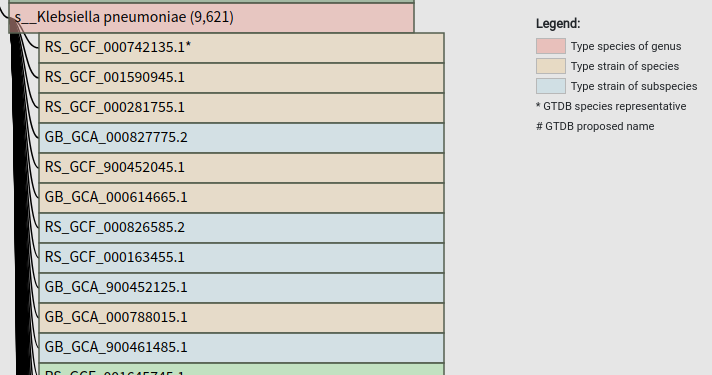

# Mutation and k-mer match%

## Genomes

### E.coli

    https://gtdb.ecogenomic.org/genomes?gid=GCF_003697165.2
    https://gtdb.ecogenomic.org/genomes?gid=GCF_000734955.1
    https://gtdb.ecogenomic.org/genomes?gid=GCA_000613265.1
    https://gtdb.ecogenomic.org/genomes?gid=GCF_000690815.1
    https://gtdb.ecogenomic.org/genomes?gid=GCA_900706755.1

    seqkit stats *.fna.gz
    file                                        format  type  num_seqs    sum_len  min_len      avg_len    max_len
    GCA_000613265.1_ASM61326v1_genomic.fna.gz   FASTA   DNA         80  4,904,109      532     61,301.4    764,832
    GCA_900706755.1_27731_A01_genomic.fna.gz    FASTA   DNA          5  5,040,580  131,389    1,008,116  2,414,346
    GCF_000690815.1_ASM69081v1_genomic.fna.gz   FASTA   DNA          2  5,038,133  131,289  2,519,066.5  4,906,844
    GCF_000734955.1_ASM73495v1_genomic.fna.gz   FASTA   DNA        135  4,980,585      207     36,893.2    382,114
    GCF_003697165.2_ASM369716v2_genomic.fna.gz  FASTA   DNA          2  5,034,834  131,333    2,517,417  4,903,501

### Klebsiella pneumoniae
    

    seqkit stats *.fna.gz
    file                                           format  type  num_seqs    sum_len  min_len      avg_len    max_len
    GCA_000614665.1_ASM61466v1_genomic.fna.gz      FASTA   DNA        201  5,470,076      551     27,214.3    156,689
    GCF_000281755.1_KlePneDSM30104_genomic.fna.gz  FASTA   DNA         27  5,512,347    2,965      204,161  1,148,365
    GCF_000742135.1_ASM74213v1_genomic.fna.gz      FASTA   DNA          5  5,545,784   16,331  1,109,156.8  5,284,261
    GCF_000788015.1_ASM78801v1_genomic.fna.gz      FASTA   DNA         87  5,725,870    1,057     65,814.6    839,135
    GCF_001590945.1_ASM159094v1_genomic.fna.gz     FASTA   DNA        141  5,463,002      508     38,744.7    275,055
    GCF_900452045.1_55064_E01_genomic.fna.gz       FASTA   DNA         10  5,594,577   28,143    559,457.7  1,862,251

## Generating datasets

Preprocessing genomes by concatenating all chromosomes

    find -name "*.fna.gz" \
        | rush -v 'acc={@(..._\d+\.\d+)_}' '(echo ">{acc}"; seqkit grep -vnir -p plasmid {} | seqkit seq -s) | seqkit seq -o {acc}.fasta.gz'
    
    seqkit stats *.fasta.gz
    file                      format  type  num_seqs    sum_len    min_len    avg_len    max_len
    GCA_000613265.1.fasta.gz  FASTA   DNA          1  4,904,109  4,904,109  4,904,109  4,904,109
    GCA_900706755.1.fasta.gz  FASTA   DNA          1  5,040,580  5,040,580  5,040,580  5,040,580
    GCF_000690815.1.fasta.gz  FASTA   DNA          1  4,906,844  4,906,844  4,906,844  4,906,844
    GCF_000734955.1.fasta.gz  FASTA   DNA          1  4,980,585  4,980,585  4,980,585  4,980,585
    GCF_003697165.2.fasta.gz  FASTA   DNA          1  4,903,501  4,903,501  4,903,501  4,903,501
    
    seqkit seq -n *.fasta.gz
    GCA_000613265.1
    GCA_900706755.1
    GCF_000690815.1
    GCF_000734955.1
    GCF_003697165.2
        
Generating reads

    len=150
    
    # merge genomes
    seqkit seq *.fasta.gz > all.fasta
    
    # splitting genomes
    seqkit sliding  -s 10 -W $len all.fasta -w 0 -o all.se$len.fasta

Blastn
    
    # makeblastdb
    makeblastdb -dbtype nucl -in all.fasta -out all
       
    # blastn
    blastn -num_threads 16 -db all -query all.se$len.fasta \
         -outfmt "6 qseqid sseqid pident length qlen slen qstart qend sstart send evalue bitscore mismatch gapopen" \
        | gzip -c > all.se$len.fasta.blastn.tsv.gz
        
Filter blastn result
        
    
    ngenomes=$(ls *.fna.gz | wc -l)
    
    # filtering
    #   1. keep the top 1 match for a subject    
    #   2. alignment length / qlen >= 0.8
    #   3. keep query that match all strains, i.e., conserved in all strains.
    #   4. skip 100% match (length == qlen && pident == 100)  
    #     
        
    csvtk uniq -Ht -f 1,2 all.se$len.fasta.blastn.tsv.gz \
        | awk '$4 / $5 >= 0.8' \
        | csvtk freq -Ht -f 1 \
        | awk -v ngenomes=$ngenomes o'$2 < ngenomes' \
        | cut -f 1 \
        | gzip -c > all.se$len.fasta.blastn.tsv.gz.blacklist.gz
        
    csvtk uniq -Ht -f 1,2 all.se$len.fasta.blastn.tsv.gz \
        | awk '$4 / $5 >= 0.8' \
        | csvtk grep -Ht -v -P all.se$len.fasta.blastn.tsv.gz.blacklist.gz \
        | awk '!($3 == 100.00 && $4 == $5)' \
        | pigz -c > all.se$len.fasta.blastn.filter.tsv.gz
    

Statistics
    
    go build && ./mutation all.fasta all.se$len.fasta.blastn.filter.tsv.gz 21 all.se$len.fasta.blastn.filter.tsv.gz.stats.gz
    
Plot

    ./plot.R all.se$len.fasta.blastn.filter.tsv.gz.stats.gz all.se$len.fasta.blastn.filter.tsv.gz.stats.gz.jpg

## Tests

kmcp

    kmcp compute -k 21 *.fna.gz -O all
    
    kmcp index -n 1 -f 0.3 -I all -O all.kmcp --dry-run
    
    kmcp search -d all.kmcp/ all.se$len.fasta -O all.se$len.fasta.kmcp.tsv.gz
    

