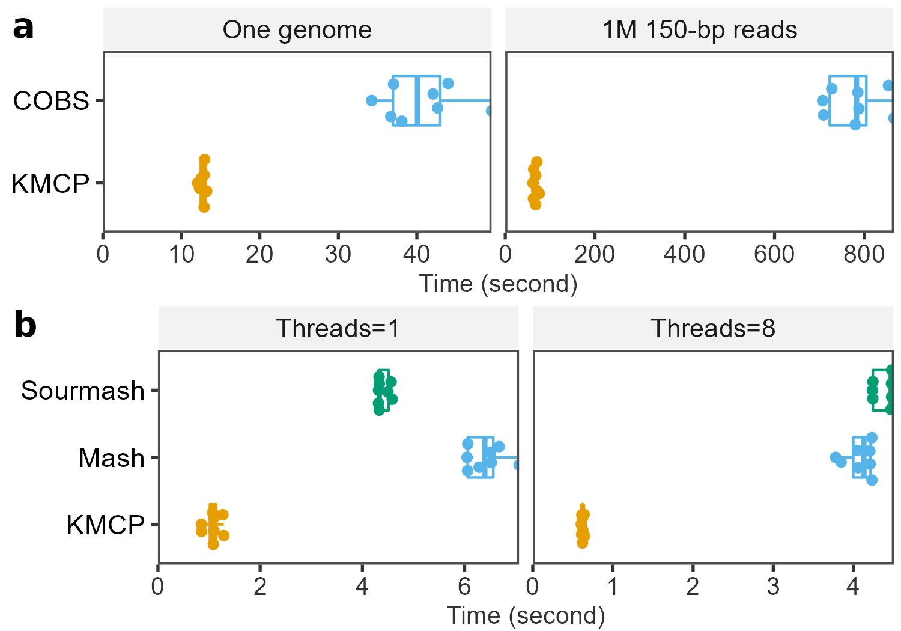

# Benchmarks on sequence and genome searching

## Softwares

Softwares

- [COBS](https://github.com/bingmann/cobs) ([1915fc0](https://github.com/bingmann/cobs/commit/1915fc061bbe47946116b4a051ed7b4e3f3eca15))
- [Sourmash](https://github.com/dib-lab/sourmash) (v4.2.2)
- [Mash](https://github.com/marbl/Mash) (v2.3)
- KMCP ([v0.8.0](https://github.com/shenwei356/kmcp/releases/tag/v0.8.0))

Utilities

- [brename](https://github.com/shenwei356/brename/releases) for batching renaming files.
- [rush](https://github.com/shenwei356/rush/releases) for executing jobs in parallel.
- [memusg](https://github.com/shenwei356/memusg) ([91a19ab](https://github.com/shenwei356/memusg/commit/91a19abaf041c3046b91ef3a35ed28aade1e05fc)) for monitoring peak memory usage and executing time.

## Datasets

GTDB representative genomes

- [gtdb_genomes_reps_r202.tar.gz](https://data.ace.uq.edu.au/public/gtdb/data/releases/release202/202.0/genomic_files_reps/gtdb_genomes_reps_r202.tar.gz)
- file size: 46.26 GB
- files: 47,894
- bases: 151.94 Gb

Uncompressing and renaming

    # uncompress
    mkdir -p gtdb202
    tar -zxvf gtdb_genomes_reps_r202.tar.gz -O gtdb202

    # rename
    brename -R -p '^(\w{3}_\d{9}\.\d+).+' -r '$1.fa.gz' gtdb202    

## KMCP vs COBS

### Building database
    
    seqs=gtdb202 # directory of gtdb sequences
    db=gtdb
    k=31
    threads=40
    
    dbCOBS=gtdb-cobs-k$k.cobs_compact
    dbKMCPtmp=gtdb-kmcp-k$k
    dbKMCP=gtdb-kmcp-k$k.db
        
    # --------------- cobs ---------------
     
    /bin/rm -rf $dbCOBS
    find $seqs -name "*.cobs_cache" | rush "/bin/rm {}"

    memusg -t -s "cobs compact-construct -T $threads -k $k -f 0.3 --num-hashes 1 -p 1024 \
        --file-type fasta $seqs $dbCOBS --keep-temporary --clobber" \
        2>$dbCOBS.time
    
    du -sh $dbCOBS > $dbCOBS.size
        
    # --------------- kmcp ---------------
    
    /bin/rm -rf $dbKMCPtmp $dbKMCP
    memusg -t -s "kmcp compute -j $threads -k $k -I $seqs -O $dbKMCPtmp --force --quiet \
        && kmcp index -j $threads -f 0.3 -n 1 -b 1024 -I $dbKMCPtmp -O $dbKMCP --force --quiet " \
        2>$dbKMCP.time

    du -sh $dbKMCP > $dbKMCP.size
    
Database size and building time.

|               |cobs      |kmcp     |
|:--------------|:---------|:--------|
|database size  | 86.96GB  | 55.15GB |
|building time  | 29m:55s  | 24min52s|
|temporary files| 160.76GB | 1.19TB  |
    
### Searching with bacterial genomes

Generating the queries

    # cobs query needs plain text
    for f in refs/*.fasta.gz; do
        gzip -d $f
    done
    
    seqkit stats -j 10 -T refs/*.fasta | csvtk csv2md -t
    
|file                    |format|type|num_seqs|sum_len|min_len|avg_len  |max_len|
|:-----------------------|:-----|:---|:-------|:------|:------|:--------|:------|
|refs/NC_000913.3.fasta  |FASTA |DNA |1       |4641652|4641652|4641652.0|4641652|
|refs/NC_002695.2.fasta  |FASTA |DNA |1       |5498578|5498578|5498578.0|5498578|
|refs/NC_011750.1.fasta  |FASTA |DNA |1       |5132068|5132068|5132068.0|5132068|
|refs/NC_012971.2.fasta  |FASTA |DNA |1       |4558953|4558953|4558953.0|4558953|
|refs/NC_013654.1.fasta  |FASTA |DNA |1       |4717338|4717338|4717338.0|4717338|
|refs/NC_018658.1.fasta  |FASTA |DNA |1       |5273097|5273097|5273097.0|5273097|
|refs/NZ_CP007592.1.fasta|FASTA |DNA |1       |5104557|5104557|5104557.0|5104557|
|refs/NZ_CP028116.1.fasta|FASTA |DNA |1       |5648177|5648177|5648177.0|5648177|

Searching
    
    # whole genome ----------------

    t=0.5
    
    # emptying the buffers cache
    # su -c "free && sync && echo 3 > /proc/sys/vm/drop_caches && free"
    
    for f in refs/*.fasta; do
        echo $f
        # cobs
        memusg -t -H -s "cobs query -T $threads -i $dbCOBS -f $f -t $t > $f.cobs@$db.txt" \
            2>$f.cobs@$db.txt.time
        
        # kmcp
        memusg -t -H -s "kmcp search -g -j $threads -d $dbKMCP    $f -t $t --quiet > $f.kmcp@$db.txt" \
            2>$f.kmcp@$db.txt.time
    done

    # time
    find refs/ -name "*.fasta" \
        | rush -k 'echo -ne {%}; \
            echo -en "\t"$(grep "elapsed time" {}.cobs@gtdb.txt.time | sed -r "s/.+: //"); \
            echo -en "\t"$(grep "peak rss" {}.cobs@gtdb.txt.time | sed -r "s/.+: //"); \
            echo -en "\t"$(grep "elapsed time" {}.kmcp@gtdb.txt.time | sed -r "s/.+: //"); \
            echo -e "\t"$(grep "peak rss" {}.kmcp@gtdb.txt.time | sed -r "s/.+: //"); \
            ' \
        | sed 's/ /\t/g' \
        | csvtk add-header -t -n "query,cobs_t,cobs_m0,kmcp_t,kmcp_m0" \
        | csvtk mutate2 -t -n cobs_m -e '$cobs_m0 / 1048576' \
        | csvtk mutate2 -t -n kmcp_m -e '$kmcp_m0 / 1048576' \
        | csvtk cut -t -f query,cobs_t,cobs_m,kmcp_t,kmcp_m \
        | csvtk rename -t -f 1-5 -n "query,cobs:time(s),cobs:memory(GB),kmcp:time(s),kmcp:memory(GB)" \
        > bench.kmcp-cobs.long.tsv
        
    csvtk csv2md -t bench.kmcp-cobs.long.tsv
        
Query time and peak memory (cold start)

|query              |cobs:time(s)|cobs:memory(GB)|kmcp:time(s)|kmcp:memory(GB)|
|:------------------|:-----------|:--------------|:-----------|:--------------|
|NC_000913.3.fasta  |67.733      |113.56         |170.532     |54.74          |
|NC_002695.2.fasta  |53.863      |118.48         |16.069      |54.91          |
|NC_011750.1.fasta  |52.687      |116.38         |12.355      |54.87          |
|NC_012971.2.fasta  |51.707      |113.09         |12.268      |54.83          |
|NC_013654.1.fasta  |54.652      |114.00         |12.536      |54.84          |
|NC_018658.1.fasta  |52.455      |117.18         |12.632      |54.87          |
|NZ_CP007592.1.fasta|50.348      |116.22         |12.691      |54.88          |
|NZ_CP028116.1.fasta|54.619      |119.33         |12.999      |54.90          |

Query time and peak memory (hot start)

|query              |cobs:time(s)|cobs:memory(GB)|kmcp:time(s)|kmcp:memory(GB)|
|:------------------|:-----------|:--------------|:-----------|:--------------|
|NC_000913.3.fasta  |38.077      |69.26          |12.533      |54.85          |
|NC_002695.2.fasta  |49.512      |82.78          |12.966      |54.86          |
|NC_011750.1.fasta  |42.081      |81.61          |12.901      |54.84          |
|NC_012971.2.fasta  |37.044      |71.42          |12.075      |54.85          |
|NC_013654.1.fasta  |34.247      |74.15          |12.319      |54.84          |
|NC_018658.1.fasta  |42.646      |80.13          |12.902      |54.88          |
|NZ_CP007592.1.fasta|36.686      |79.34          |12.945      |54.86          |
|NZ_CP028116.1.fasta|43.989      |84.34          |13.226      |54.85          |

### Searching with short reads

Generating the queries
    
    for f in refs/*.fasta; do
        cat $f | seqkit sliding -s 4 -W 150  > $f.short
    done

    seqkit stats -j 10 -T refs/*.short | csvtk csv2md -t
    
|file                          |format|type|num_seqs|sum_len  |min_len|avg_len|max_len|
|:-----------------------------|:-----|:---|:-------|:--------|:------|:------|:------|
|refs/NC_000913.3.fasta.short  |FASTA |DNA |1160376 |174056400|150    |150.0  |150    |
|refs/NC_002695.2.fasta.short  |FASTA |DNA |1374608 |206191200|150    |150.0  |150    |
|refs/NC_011750.1.fasta.short  |FASTA |DNA |1282980 |192447000|150    |150.0  |150    |
|refs/NC_012971.2.fasta.short  |FASTA |DNA |1139701 |170955150|150    |150.0  |150    |
|refs/NC_013654.1.fasta.short  |FASTA |DNA |1179298 |176894700|150    |150.0  |150    |
|refs/NC_018658.1.fasta.short  |FASTA |DNA |1318237 |197735550|150    |150.0  |150    |
|refs/NZ_CP007592.1.fasta.short|FASTA |DNA |1276102 |191415300|150    |150.0  |150    |
|refs/NZ_CP028116.1.fasta.short|FASTA |DNA |1412007 |211801050|150    |150.0  |150    |

Query time and peak memory (hot start)

    t=0.8
    
    for f in refs/*.fasta.short; do
        echo $f
        # cobs
        # --load-complete 
        memusg -t -H -s "cobs query -T $threads -i $dbCOBS -f $f -t $t > $f.cobs@$db.txt" \
            2>$f.cobs@$db.txt.time
        
        # kmcp
        # --load-whole-db
        memusg -t -H -s "kmcp search -g -j $threads -d $dbKMCP    $f -t $t --quiet > $f.kmcp@$db.txt" \
            2>$f.kmcp@$db.txt.time
    done

    find refs/ -name "*.fasta.short" \
        | rush -k 'echo -ne {%}; \
            echo -en "\t"$(grep "elapsed time" {}.cobs@gtdb.txt.time | sed -r "s/.+: //"); \
            echo -en "\t"$(grep "peak rss" {}.cobs@gtdb.txt.time | sed -r "s/.+: //"); \
            echo -en "\t"$(grep "elapsed time" {}.kmcp@gtdb.txt.time | sed -r "s/.+: //"); \
            echo -e "\t"$(grep "peak rss" {}.kmcp@gtdb.txt.time | sed -r "s/.+: //"); \
            ' \
        | sed 's/ /\t/g' \
        | csvtk add-header -t -n "query,cobs_t,cobs_m0,kmcp_t,kmcp_m0" \
        | csvtk mutate2 -t -n cobs_m -e '$cobs_m0 / 1048576' \
        | csvtk mutate2 -t -n kmcp_m -e '$kmcp_m0 / 1048576' \
        | csvtk cut -t -f query,cobs_t,cobs_m,kmcp_t,kmcp_m \
        | csvtk rename -t -f 1-5 -n "query,cobs:time(s),cobs:memory(GB),kmcp:time(s),kmcp:memory(GB)" \
        > bench.kmcp-cobs.short.tsv
        
    csvtk csv2md -t bench.kmcp-cobs.short.tsv

|query                    |cobs:time(s)|cobs:memory(GB)|kmcp:time(s)|kmcp:memory(GB)|
|:------------------------|:-----------|:--------------|:-----------|:--------------|
|NC_000913.3.fasta.short  |709.126     |103.54         |61.606      |59.38          |
|NC_002695.2.fasta.short  |865.891     |116.64         |70.424      |61.24          |
|NC_011750.1.fasta.short  |785.426     |110.93         |67.699      |59.58          |
|NC_012971.2.fasta.short  |707.142     |102.15         |63.483      |59.48          |
|NC_013654.1.fasta.short  |727.527     |104.93         |62.750      |59.38          |
|NC_018658.1.fasta.short  |787.855     |113.57         |70.082      |61.24          |
|NZ_CP007592.1.fasta.short|779.729     |111.10         |67.929      |59.39          |
|NZ_CP028116.1.fasta.short|853.900     |118.57         |75.900      |60.71          |

Query time and peak memory (hot start, loading all data in memory)

    t=0.8
    
    for f in refs/*.fasta.short; do
        echo $f
        # cobs
        # --load-complete 
        memusg -t -H -s "cobs query --load-complete  -T $threads -i $dbCOBS -f $f -t $t > $f.cobs@$db.txt" \
            2>$f.cobs@$db.txt.time2
        
        # kmcp
        # --load-whole-db
        memusg -t -H -s "kmcp search --load-whole-db -g -j $threads -d $dbKMCP    $f -t $t --quiet > $f.kmcp@$db.txt" \
            2>$f.kmcp@$db.txt.time2
    done

    find refs/ -name "*.fasta.short" \
        | rush -k 'echo -ne {%}; \
            echo -en "\t"$(grep "elapsed time" {}.cobs@gtdb.txt.time2 | sed -r "s/.+: //"); \
            echo -en "\t"$(grep "peak rss" {}.cobs@gtdb.txt.time2 | sed -r "s/.+: //"); \
            echo -en "\t"$(grep "elapsed time" {}.kmcp@gtdb.txt.time2 | sed -r "s/.+: //"); \
            echo -e "\t"$(grep "peak rss" {}.kmcp@gtdb.txt.time2 | sed -r "s/.+: //"); \
            ' \
        | sed 's/ /\t/g' \
        | csvtk add-header -t -n "query,cobs_t,cobs_m0,kmcp_t,kmcp_m0" \
        | csvtk mutate2 -t -n cobs_m -e '$cobs_m0 / 1048576' \
        | csvtk mutate2 -t -n kmcp_m -e '$kmcp_m0 / 1048576' \
        | csvtk cut -t -f query,cobs_t,cobs_m,kmcp_t,kmcp_m \
        | csvtk rename -t -f 1-5 -n "query,cobs:time(s),cobs:memory(GB),kmcp:time(s),kmcp:memory(GB)" \
        > bench.kmcp-cobs-loadall.short.tsv
        
    csvtk csv2md -t bench.kmcp-cobs-loadall.short.tsv
    
For a database of large number of reference genomes, loading complete database does not help increase the speed.

|query                    |cobs:time(s)|cobs:memory(GB)|kmcp:time(s)|kmcp:memory(GB)|
|:------------------------|:-----------|:--------------|:-----------|:--------------|
|NC_000913.3.fasta.short  |745.945     |140.11         |75.472      |64.83          |
|NC_002695.2.fasta.short  |887.930     |149.92         |88.510      |66.68          |
|NC_011750.1.fasta.short  |838.736     |145.73         |84.674      |64.83          |
|NC_012971.2.fasta.short  |738.051     |139.17         |76.511      |64.83          |
|NC_013654.1.fasta.short  |768.631     |140.97         |68.738      |64.83          |
|NC_018658.1.fasta.short  |855.912     |147.34         |76.041      |66.68          |
|NZ_CP007592.1.fasta.short|854.553     |145.41         |77.974      |64.83          |
|NZ_CP028116.1.fasta.short|904.421     |151.63         |83.184      |66.93          |

## KMCP vs Mash and Sourmash

### Building database (MinHash sketches)

    seqs=gtdb202
    db=gtdb
    k=31
    threads=8
    scale=1000
    scaleMash=3400 # average genome size: 3.4Mb.
    
    dbMASH=gtdb-mash-k$k-S$scaleMash.msh
    dbSOURMASHtmp=gtdb-sourmash-k$k-D$scale
    dbSOURMASH=gtdb-sourmash-k$k-D$scale/_db.sbt.json
    dbKMCPtmp=gtdb-kmcp-k$k-D$scale
    dbKMCP=gtdb-kmcp-k$k-D$scale.db
    
    
    # --------------- mash ---------------
    
    find $seqs -name *.fa.gz > $seqs.list
    memusg -t -s "mash sketch -p $threads -s $scaleMash -k $k -o $dbMASH -l $seqs.list " \
        2>$dbMASH.time
    
    
    # --------------- sourmash ---------------
    
    # 89m59.612s
    # 5.19G
    mkdir -p $dbSOURMASHtmp
    indexSourmash() {
        find $seqs -name "*.fa.gz" \
            | rush -j $threads -v d=$dbSOURMASHtmp -v s=$scale -v k=$k \
                'sourmash -q sketch dna -p k={k},scaled={s} {} -o {d}/{%}.sig'     
        sourmash -q index $dbSOURMASH --from-file <(find $dbSOURMASHtmp -name "*.sig")
    }
    
    { time indexSourmash ; } 2> $dbSOURMASH.time
    

    # --------------- kmcp ---------------
    
    memusg -t -s "kmcp compute -j $threads -k $k -I $seqs -O $dbKMCPtmp -D $scale --force --quiet \
        && kmcp index -j $threads -f 0.001 -n 3 -I $dbKMCPtmp -O $dbKMCP --force --quiet " \
        2>$dbKMCP.time

|               |mash   |sourmash  |kmcp    |
|:--------------|:------|:---------|:-------|
|database size  |743MB  | 5.19GB   | 1.52GB |
|buiding time   |11m39s | 89m59s   | 7min02s|
|temporary files|-      |-         | 3.41GB |

### Searching with bacterial genomes
    
    # emptying the buffers cache
    # su -c "free && sync && echo 3 > /proc/sys/vm/drop_caches && free"
    
    
    threads=1
    
    t=0.4
    for f in refs/*.fasta; do
        echo $f
        # mash
        memusg -t -H -s "mash dist -p $threads -s $scaleMash -v 0.01 -d 0.05 $dbMASH $f > $f.mash@$db.txt " \
            2>$f.mash@$db.txt.time
        
        # sourmash
        memusg -t -H -s "sourmash -q sketch dna -p k=$k,scaled=$scale $f -o $f.sig; \
            sourmash -q search $f.sig $dbSOURMASH  --threshold $t > $f.sourmash@$db.txt" \
            2>$f.sourmash@$db.txt.time
        
        # kmcp
        memusg -t -H -s "kmcp search -g -j $threads -d $dbKMCP    $f -t $t --quiet > $f.kmcp.scaled@$db.txt" \
            2>$f.kmcp.scaled@$db.txt.time
    done

    # time
    find refs/ -name "*.fasta" \
        | rush -k 'echo -ne {%}; \
            echo -en "\t"$(grep "elapsed time" {}.mash@gtdb.txt.time | sed -r "s/.+: //"); \
            echo -en "\t"$(grep "peak rss" {}.mash@gtdb.txt.time | sed -r "s/.+: //"); \
            echo -en "\t"$(grep "elapsed time" {}.sourmash@gtdb.txt.time | sed -r "s/.+: //"); \
            echo -en "\t"$(grep "peak rss" {}.sourmash@gtdb.txt.time | sed -r "s/.+: //"); \
            echo -en "\t"$(grep "elapsed time" {}.kmcp.scaled@gtdb.txt.time | sed -r "s/.+: //"); \
            echo -e "\t"$(grep "peak rss" {}.kmcp.scaled@gtdb.txt.time | sed -r "s/.+: //"); \
            ' \
        | sed 's/ /\t/g' \
        | csvtk add-header -t -n "query,mash_t,mash_m0,sourmash_t,sourmash_m0,kmcp_t,kmcp_m0" \
        | csvtk mutate2 -t -n mash_m -e '$mash_m0 / 1024' \
        | csvtk mutate2 -t -n sourmash_m -e '$sourmash_m0 / 1024' \
        | csvtk mutate2 -t -n kmcp_m -e '$kmcp_m0 / 1024' \
        | csvtk cut -t -f query,mash_t,mash_m,sourmash_t,sourmash_m,kmcp_t,kmcp_m \
        | csvtk rename -t -f 1-7 -n "query,mash:time(s),mash:mem(MB),sourmash:time(s),sourmash:mem(MB),kmcp:time(s),kmcp:mem(MB)" \
        > bench.kmcp-mash-sourmash.thread$threads.tsv
        
    csvtk csv2md -t bench.kmcp-mash-sourmash.thread$threads.tsv
        
    
Query time and peak memory (mash and kmcp utilize single thread, cold start)

|query              |mash:time(s)|mash:mem(MB)|sourmash:time(s)|sourmash:mem(MB)|kmcp:time(s)|kmcp:mem(MB)|
|:------------------|:-----------|:-----------|:---------------|:---------------|:-----------|:-----------|
|NC_000913.3.fasta  |6.152       |2515.87     |13.061          |248.26          |20.204      |681.07      |
|NC_002695.2.fasta  |6.776       |2518.40     |7.593           |230.26          |4.853       |737.49      |
|NC_011750.1.fasta  |6.498       |2516.28     |4.665           |228.50          |1.281       |703.99      |
|NC_012971.2.fasta  |6.892       |2515.50     |4.248           |228.49          |1.044       |540.29      |
|NC_013654.1.fasta  |6.579       |2518.83     |4.248           |226.51          |1.488       |649.11      |
|NC_018658.1.fasta  |6.565       |2516.71     |4.474           |230.59          |1.255       |588.92      |
|NZ_CP007592.1.fasta|6.540       |2519.28     |4.913           |222.53          |1.284       |597.50      |
|NZ_CP028116.1.fasta|6.299       |2517.82     |5.118           |228.51          |1.291       |512.18      |

Query time and peak memory (mash and kmcp utilize single thread, hot start)

|query              |mash:time(s)|mash:mem(MB)|sourmash:time(s)|sourmash:mem(MB)|kmcp:time(s)|kmcp:mem(MB)|
|:------------------|:-----------|:-----------|:---------------|:---------------|:-----------|:-----------|
|NC_000913.3.fasta  |6.057       |2515.18     |4.316           |222.52          |0.854       |568.07      |
|NC_002695.2.fasta  |6.522       |2518.07     |4.561           |222.53          |1.288       |605.14      |
|NC_011750.1.fasta  |6.676       |2515.18     |4.331           |230.50          |1.072       |664.12      |
|NC_012971.2.fasta  |6.283       |2516.24     |4.316           |232.48          |0.851       |346.34      |
|NC_013654.1.fasta  |6.062       |2517.02     |4.326           |222.52          |1.084       |361.44      |
|NC_018658.1.fasta  |6.508       |2516.40     |4.500           |222.53          |1.094       |680.78      |
|NZ_CP007592.1.fasta|7.065       |2515.96     |4.329           |222.53          |1.096       |397.45      |
|NZ_CP028116.1.fasta|6.048       |2517.14     |4.583           |232.49          |1.270       |602.71      |

Query time and peak memory (mash and kmcp utilize 8 threads, cold start)

|query              |mash:time(s)|mash:mem(MB)|sourmash:time(s)|sourmash:mem(MB)|kmcp:time(s)|kmcp:mem(MB)|
|:------------------|:-----------|:-----------|:---------------|:---------------|:-----------|:-----------|
|NC_000913.3.fasta  |2.292       |1495.78     |12.994          |228.59          |4.868       |682.43      |
|NC_002695.2.fasta  |2.517       |1494.37     |7.227           |238.47          |2.219       |713.38      |
|NC_011750.1.fasta  |2.343       |1496.29     |4.671           |230.50          |0.563       |705.36      |
|NC_012971.2.fasta  |2.347       |1495.78     |4.220           |230.49          |0.646       |227.00      |
|NC_013654.1.fasta  |2.544       |1495.78     |4.234           |230.49          |0.644       |360.12      |
|NC_018658.1.fasta  |2.340       |1496.29     |4.468           |228.51          |0.620       |41.04       |
|NZ_CP007592.1.fasta|2.341       |1496.30     |4.843           |234.49          |0.632       |81.90       |
|NZ_CP028116.1.fasta|2.547       |1496.84     |4.866           |232.50          |0.647       |76.75       |

Query time and peak memory (mash and kmcp utilize 8 threads, hot start)

|query              |mash:time(s)|mash:mem(MB)|sourmash:time(s)|sourmash:mem(MB)|kmcp:time(s)|kmcp:mem(MB)|
|:------------------|:-----------|:-----------|:---------------|:---------------|:-----------|:-----------|
|NC_000913.3.fasta  |4.209       |2515.24     |4.241           |228.50          |0.620       |36.24       |
|NC_002695.2.fasta  |4.205       |2516.84     |4.477           |228.50          |0.610       |51.00       |
|NC_011750.1.fasta  |4.230       |2517.41     |4.467           |222.52          |0.624       |59.85       |
|NC_012971.2.fasta  |4.231       |2516.90     |4.243           |222.52          |0.613       |158.48      |
|NC_013654.1.fasta  |4.058       |2517.50     |4.237           |222.52          |0.646       |127.05      |
|NC_018658.1.fasta  |3.846       |2516.50     |4.478           |236.48          |0.641       |460.02      |
|NZ_CP007592.1.fasta|3.778       |2516.32     |4.475           |234.48          |0.622       |301.88      |
|NZ_CP028116.1.fasta|4.049       |2517.30     |4.505           |222.53          |0.605       |730.17      |

