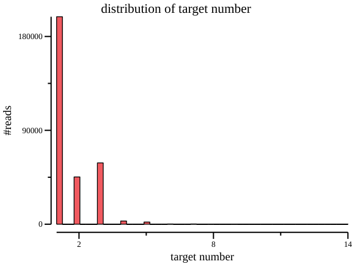

### Analysis of ambiguous and unambiguous reads
    
    # clean
    zcat mock.kmcp.gz  | csvtk rename -C$ -t -f 1 -n query | csvtk uniq -t -f query,target -o t.gz
    
    # frequency of the number of hits
    csvtk freq -t -f query -nr t.gz -o t.gz.freq1
    
    # ID of unambiguous reads
    csvtk filter2 -t -f '$frequency==1' t.gz.freq1 | csvtk cut -t -f query -o t.gz.uniq.reads
        
    # total number of reads
    csvtk nrow t.gz.freq1
    308839
    
    # number of unambiguous reads
    csvtk nrow t.gz.uniq.reads
    198911
    
    # distribution of target number
    csvtk plot hist -t -f frequency t.gz.freq1 -o t.gz.freq1.hist.png \
        --title "distribution of target number" --xlab "target number" --ylab "#reads"
    
The distribution of target number:

    
    # pair of query and target
    csvtk freq -t -f query,target  t.gz -o t.gz.pair
    
The number of unambiguous reads:

    csvtk grep -t -f query -P t.gz.uniq.reads t.gz.pair \
        | csvtk freq -t -f target -nr \
        | csvtk join -t -k - name2.map genome_size.tsv \
        | csvtk mutate2 -t -n fraction -e '$frequency / ${genome_size}' -w 6 \
        | csvtk csv2md -t
        
|target         |frequency|species                   |genome_size|fraction|
|:--------------|:--------|:-------------------------|:----------|:-------|
|GCF_000742135.1|63665    |Klebsiella pneumoniae     |5545784    |0.011480|
|GCF_000006945.2|57300    |Salmonella enterica       |4951383    |0.011573|
|GCF_003697165.2|27831    |Escherichia coli          |5034834    |0.005528|
|GCF_002950215.1|17898    |Shigella flexneri         |4938295    |0.003624|
|GCF_002949675.1|17152    |Shigella dysenteriae      |4578459    |0.003746|
|GCF_000392875.1|3433     |Enterococcus faecalis     |2881400    |0.001191|
|GCF_001544255.1|2951     |Enterococcus faecium      |2484851    |0.001188|
|GCF_900638025.1|2417     |Haemophilus parainfluenzae|2062405    |0.001172|
|GCF_001457655.1|2182     |Haemophilus influenzae    |1890645    |0.001154|
|GCF_001027105.1|1599     |Staphylococcus aureus     |2782562    |0.000575|
|GCF_006742205.1|1445     |Staphylococcus epidermidis|2427041    |0.000595|
|GCF_000017205.1|391      |Pseudomonas aeruginosa    |6588339    |0.000059|
|GCF_009759685.1|259      |Acinetobacter baumannii   |3990388    |0.000065|
|GCF_001096185.1|208      |Streptococcus pneumoniae  |2117177    |0.000098|
|GCF_000148585.2|180      |Streptococcus mitis       |1868883    |0.000096|

The number of ambiguous reads:

    csvtk grep -t -f query -v -P t.gz.uniq.reads t.gz.pair \
        | csvtk replace -t -f target -p '(.+)' -k name2.map -r '{kv}' \
        | csvtk sort -t -k query -k target \
        | csvtk fold -t -f query -v target \
        | csvtk freq -t -f target -nr \
        | csvtk filter2 -t -f '$frequency >= 200' \
        | csvtk csv2md -t
        
|target                                                                                               |frequency|
|:----------------------------------------------------------------------------------------------------|:--------|
|Escherichia coli; Shigella dysenteriae; Shigella flexneri                                            |57173    |
|Shigella dysenteriae; Shigella flexneri                                                              |20811    |
|Escherichia coli; Shigella flexneri                                                                  |13160    |
|Escherichia coli; Shigella dysenteriae                                                               |9473     |
|Escherichia coli; Klebsiella pneumoniae; Salmonella enterica; Shigella dysenteriae; Shigella flexneri|2055     |
|Escherichia coli; Salmonella enterica; Shigella dysenteriae; Shigella flexneri                       |1719     |
|Escherichia coli; Klebsiella pneumoniae; Shigella dysenteriae; Shigella flexneri                     |1212     |
|Escherichia coli; Klebsiella pneumoniae                                                              |638      |
|Klebsiella pneumoniae; Shigella dysenteriae; Shigella flexneri                                       |587      |
|Escherichia coli; Klebsiella pneumoniae; Shigella dysenteriae                                        |546      |
|Klebsiella pneumoniae; Salmonella enterica                                                           |232      |
