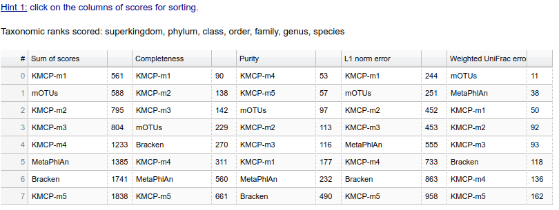
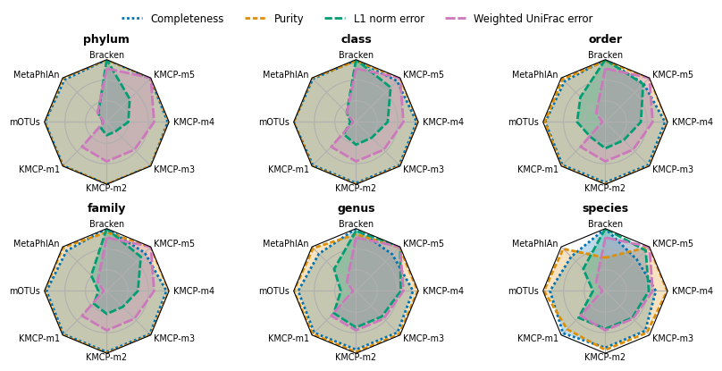
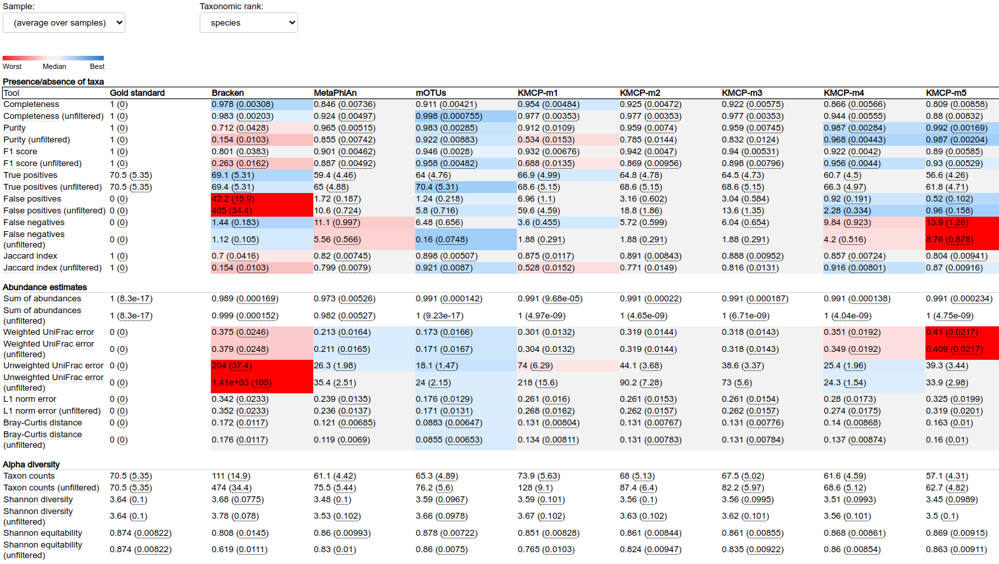

## Benchmark

## CAMI2 mouse gut (prokaryotes)

[Software, databases and commands details](https://github.com/shenwei356/kmcp/tree/main/benchmarks/cami2-mouse-gut).

**Softwares:**

- mOTUs 2.5.1
- MetaPHlAn 2.9.21
- Bracken 2.5
- KMCP v0.7.0

**Databases:** RefSeq and Taxonomy snapshot provided by CAMI2 (2019-01-08)

**Rankings**

**Relative performance**

**Metrics table**

## Sun et al's 25 simulated communities (prokaryotes)

[Software, databases and commands details](https://github.com/shenwei356/kmcp/tree/main/benchmarks/sun2021).

**Softwares:**

- KMCP ([v0.7.0](https://github.com/shenwei356/kmcp/releases/tag/v0.7.0))
- mOTUs [3.0.1 (Jul 28, 2021)](https://github.com/motu-tool/mOTUs/releases/tag/3.0.1)
- MetaPhlAn [3.0.13 (27 Jul, 2021)](https://github.com/biobakery/MetaPhlAn/releases/tag/3.0.13)
- Kraken [v2.1.2](https://github.com/DerrickWood/kraken2/releases/tag/v2.1.2),
  Bracken [v2.6.2](https://github.com/jenniferlu717/Bracken/releases/tag/v2.6.2)

**Databases and taxonomy version:**

- KMCP,  GTDB-RS202 (2021-04-27), 2021-10
- mOTUs, 3.0.1 (2021-06-28), 2019-01
- MetaPhlAn, mpa_v30_CHOCOPhlAn_201901 (?), 2019-01
- Kraken, PlusPF (2021-05-17), 2021-05-17

In this benchmark, we generate metagenomic profiles with the same NCBI Taxonomy version 2021-12-06,
including the gold-standard profiles.

**Rankings**

**Relative performance**

**Metrics table**

## Roux et al's 16 mock virome communities (viruses/phages)

[Software, databases and commands details](https://github.com/shenwei356/kmcp/tree/main/benchmarks/mock-virome).

**Softwares:**

- KMCP ([v0.7.0](https://github.com/shenwei356/kmcp/releases/tag/v0.7.0)
- MetaPhlAn [3.0.13 (27 Jul, 2021)](https://github.com/biobakery/MetaPhlAn/releases/tag/3.0.13)
- Kraken [v2.1.2](https://github.com/DerrickWood/kraken2/releases/tag/v2.1.2),
  Bracken [v2.6.2](https://github.com/jenniferlu717/Bracken/releases/tag/v2.6.2)

**Databases and taxonomy version:**

- KMCP,  genbank-viral (2021-12-06), 2021-12-06
- MetaPhlAn, mpa_v30_CHOCOPhlAn_201901 (?), 2019-01
- Kraken, PlusPF (2021-05-17), 2021-05-17

In this benchmark, we generate metagenomic profiles with the same NCBI Taxonomy version 2021-12-06,
including the gold-standard profiles.
