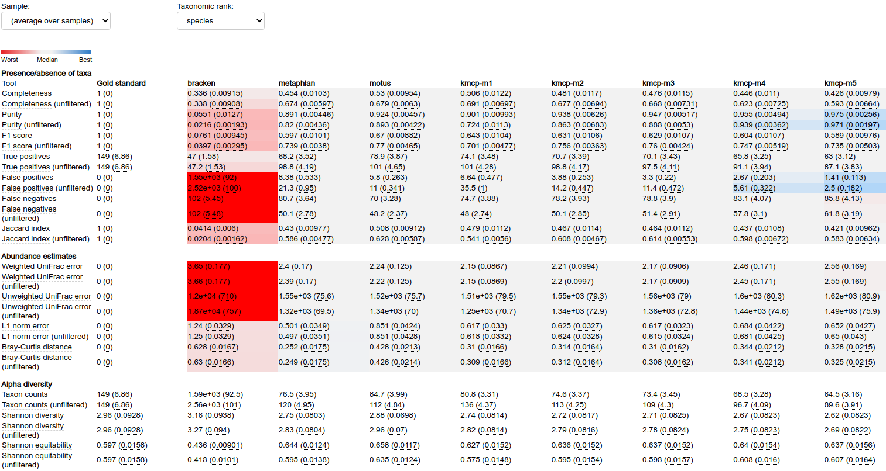
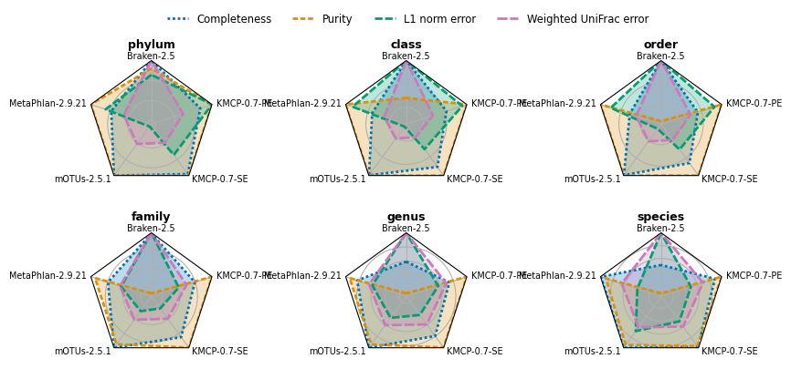
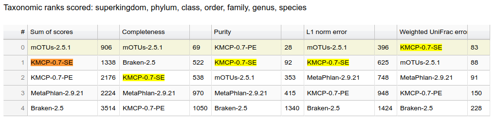

## Benchmark

## CAMI2 mouse gut

[Software, databases and commands details](https://github.com/shenwei356/kmcp/tree/main/benchmarks/cami2-mouse-gut).

Softwares:

- mOTUs 2.5.1
- MetaPHlAn 2.9.21
- Bracken 2.5
- KMCP v0.7.0

Databases: RefSeq and Taxonomy snapshot provided by CAMI2 (2019-01-08)

**Metrics table**

**Relative performance**

**Rankings**

## Sun et al's 25 simulated communities

