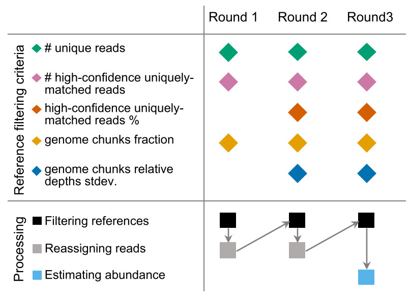

# Metagenomic profiling

## Requirements

- Database
    - [Prebuilt databases](/database/#prebuilt-databases) are available.
    - Or [build custom databases](/database/#custom-database).
- Hardware.
    - CPU: ≥ 32 cores preferred.
    - RAM: ≥ 64 GB, depends on file size of the maximal database.

## Datasets

- Short reads, single or paired end.

## Steps

### Step 1. Preprocessing reads

For example, removing adapters and trimming using [fastp](https://github.com/OpenGene/fastp):

    fastp -i in_1.fq.gz -I in_2.fq.gz  \
        -o out_1.fq.gz -O out_2.fq.gz \
        -l 75 -q 20 -W 4 -M 20 -3 20 --thread 32 \
        --html out.fastp.html

### Step 2. Removing host reads

Tools:

- [bowtie2](https://github.com/BenLangmead/bowtie2) is [recommended](https://doi.org/10.1099/mgen.0.000393) for removing host reads.
- [samtools](https://github.com/samtools/samtools) is also used for processing reads mapping file.
- [pigz](https://zlib.net/pigz/) is a parallel implementation of `gzip`, which is much faster than `gzip`.

Host reference genomes:

- Human: [CHM13](https://github.com/marbl/CHM13). We also provide a database of CHM13 for fast removing human reads.

Building the index (~60min):
    
    bowtie2-build --threads 32 GCA_009914755.3_CHM13_T2T_v1.1_genomic.fna.gz chm13

Mapping and removing mapped reads:

    index=~/ws/db/bowtie2/chm13
    
    bowtie2 --threads 32 -x $index -1 in_1.fq.gz -2 in_2.fq.gz  \
        | samtools view -buS -f 4 - \
        | samtools fastq - \
        | gzip -c > sample.fq.gz

### Step 3. Searching

**Reads can be searched against multiple databases which can be built with different parameters**,
and the results can be fastly merged for downstream analysis.

#### **Attentions**

1. Input format should be (gzipped) FASTA or FASTQ from files or stdin.
   Paired-End reads should be given via `-1/--read1` and `-2/--read2`.

        kmcp search -d db -1 read_1.fq.gz -2 read_2.fq.gz -o read.tsv.gz

    Single-end can be given as positional arguments or `-1`/`-2`.

        kmcp search -d db file1.fq.gz file2.fq.gz -o result.tsv.gz

    **Single-end mode is recommended for paired-end reads, for higher sensitivity**.
    See [benchmark](https://bioinf.shenwei.me/kmcp/benchmark/profiling).

2. A long query sequence may contain duplicated k-mers, which are
    not removed for short sequences by default. You may modify the
    value of `-u/--kmer-dedup-threshold` (default `256`) to remove duplicates.
3. For long reads or contigs, you should split them into short reads
    using `seqkit sliding`, e.g.,

        seqkit sliding -s 100 -W 300

4. The values of `tCov` and `jacc` in results only apply to databases built with a single size of k-mer.

**`kmcp search` and `kmcp profile` share some flags**, therefore users
can use stricter criteria in `kmcp profile`.

1. `-t/--min-query-cov`, minimal query coverage, i.e., 
   proportion of matched k-mers and unique k-mers of a query (default `0.55`, close to `~96.5%` sequence similarity)

#### **Index files loading modes**

1. Using memory-mapped index files with `mmap` (default):
    - Faster startup speed when index files are buffered in memory.
    - Multiple KMCP processes can share the memory.
2. Loading the whole index files into memory (`-w/--load-whole-db`):
    - This mode occupies a little more memory.
    And multiple KMCP processes can not share the database in memory.
    - **It's slightly faster due to the use of physically contiguous memory.
    The speedup is more significant for smaller databases**.
    - **Please switch on this flag when searching on computer clusters,
        where the default mmap mode would be very slow for network-attached
        storage (NAS)**.
3. Low memory mode (`--low-mem`):
    - Do not load all index files into memory nor use mmap, using file seeking.
    - It's much slower, >4X slower on SSD and would be much slower on HDD disks.
    - **Only use this mode for small number of queries or a huge database that
    can't be loaded into memory**.

**Performance tips**:

1. Increase the value of `-j/--threads` for acceleratation, but values larger
  than the the number of CPU cores won't bring extra speedup.

#### **Commands**

**Single-end mode is recommended for paired-end reads, for higher sensitivity**:

    # ---------------------------------------------------
    # single-end (recommended)

    read1=sample_1.fq.gz
    read2=sample_2.fq.gz
    sample=sample

    # 1. searching results against multiple databases
    for db in refseq-fungi.kmcp genbank-viral.kmcp gtdb.kmcp ; do
        dbname=$(basename $db)

        kmcp search \
            --threads            32 \
            --db-dir            $db \
            --min-kmers          10 \
            --min-query-len      30 \
            --min-query-cov    0.55 \
            $read1   $read2         \
            --out-file         $sample.kmcp@$dbname.tsv.gz \
            --log              $sample.kmcp@$dbname.tsv.gz.log
    done
    
    # 2. Merging search results against multiple databases
    kmcp merge $sample.kmcp@*.tsv.gz --out-file $sample.kmcp.tsv.gz

Pair-end reads:

    # ---------------------------------------------------
    # paired-end
    
    read1=sample_1.fq.gz
    read2=sample_2.fq.gz
    sample=sample
    
    # 1. searching results against multiple databases
    for db in refseq-fungi.kmcp genbank-viral.kmcp gtdb.kmcp ; do
        dbname=$(basename $db)

        kmcp search \
            --threads            32 \
            --db-dir            $db \
            --min-kmers          10 \
            --min-query-len      30 \
            --min-query-cov    0.55 \
            --read1          $read1 \
            --read2          $read2 \
            --out-file       $sample.kmcp@$dbname.tsv.gz \
            --log            $sample.kmcp@$dbname.tsv.gz.log
    done

    # 2. Merging search results against multiple databases
    kmcp merge $sample.kmcp@*.tsv.gz --out-file $sample.kmcp.tsv.gz
    
#### Search result format

Tab-delimited format with 15 columns:

```
 1. query,    Identifier of the query sequence
 2. qLen,     Query length
 3. qKmers,   K-mer number of the query sequence
 4. FPR,      False positive rate of the match
 5. hits,     Number of matches
 6. target,   Identifier of the target sequence
 7. chunkIdx, Index of reference chunk
 8. chunks,   Number of reference chunks
 9. tLen,     Reference length
10. kSize,    K-mer size
11. mKmers,   Number of matched k-mers
12. qCov,     Query coverage,  equals to: mKmers / qKmers
13. tCov,     Target coverage, equals to: mKmers / K-mer number of reference chunk
14. jacc,     Jaccard index
15. queryIdx, Index of query sequence, only for merging
```

Note: The header line starts with `#`, you need to assign another comment charactor
if using `csvtk` for analysis. e.g.,

    csvtk filter2 -C '$' -t -f '$qCov > 0.7' mock.fastq.gz.kmcp.gz

Demo result:

|#query                             |qLen|qKmers|FPR       |hits|target       |chunkIdx|chunks|tLen   |kSize|mKmers|qCov  |tCov  |jacc  |queryIdx|
|:----------------------------------|:---|:-----|:---------|:---|:------------|:-------|:-----|:------|:----|:-----|:-----|:-----|:-----|:-------|
|NC_000913.3_sliding:1244941-1245090|150 |120   |1.5955e-26|6   |NC_012971.2  |2       |10    |4558953|31   |120   |1.0000|0.0003|0.0003|0       |
|NC_000913.3_sliding:1244941-1245090|150 |120   |1.5955e-26|6   |NC_000913.3  |2       |10    |4641652|31   |120   |1.0000|0.0003|0.0003|0       |
|NC_000913.3_sliding:1244941-1245090|150 |120   |1.5955e-26|6   |NC_018658.1  |5       |10    |5273097|31   |120   |1.0000|0.0002|0.0002|0       |
|NC_013654.1_sliding:344871-345020  |150 |120   |1.5955e-26|8   |NC_012971.2  |0       |10    |4558953|31   |120   |1.0000|0.0003|0.0003|1       |
|NC_013654.1_sliding:344871-345020  |150 |120   |1.5955e-26|8   |NC_000913.3  |0       |10    |4641652|31   |120   |1.0000|0.0003|0.0003|1       |
|NC_013654.1_sliding:344871-345020  |150 |120   |1.5955e-26|8   |NC_013654.1  |0       |10    |4717338|31   |120   |1.0000|0.0003|0.0003|1       |
|NC_013654.1_sliding:344871-345020  |150 |120   |1.5955e-26|8   |NZ_CP007592.1|1       |10    |5104557|31   |120   |1.0000|0.0002|0.0002|1       |
|NC_013654.1_sliding:344871-345020  |150 |120   |1.5955e-26|8   |NC_018658.1  |7       |10    |5273097|31   |120   |1.0000|0.0002|0.0002|1       |
|NC_013654.1_sliding:344871-345020  |150 |120   |1.5955e-26|8   |NZ_CP028116.1|0       |10    |5648177|31   |120   |1.0000|0.0002|0.0002|1       |

#### Searching on a computer cluster

Here, we split genomes of GTDB into 16 partitions and build a database for 
every partition, so we can use computer cluster to accelerate the searching.
The genbank-viral genomes are also diveded into 4 partition.

A helper script [easy_sbatch](https://github.com/shenwei356/easy_sbatch)
is used for batch submitting Slurm jobs via script templates.
    
    # ---------------------------------------------------
    # searching
    
    
    j=32
    reads=reads
    
    # -----------------
    # gtdb
    
    dbprefix=~/ws/db/kmcp/gtdb.n16-
    
    for file in $reads/*.left.fq.gz; do
        prefix=$(echo $file | sed 's/.left.fq.gz//')
        read1=$file
        read2=$(echo $file | sed 's/left.fq.gz/right.fq.gz/')
        
        ls -d $dbprefix*.kmcp \
            | easy_sbatch \
                -c $j -J $(basename $prefix) \
                "kmcp search         \
                    --load-whole-db  \
                    --threads   $j   \
                    --db-dir    {}   \
                    $read1 $read2    \
                    --out-file  $prefix.kmcp@\$(basename {}).tsv.gz \
                    --log       $prefix.kmcp@\$(basename {}).tsv.gz.log \
                    --quiet "
    done
    
    # -----------------
    # viral
    
    dbprefix=~/ws/db/kmcp/genbank-viral.n4-
    
    for file in $reads/*.left.fq.gz; do
        prefix=$(echo $file | sed 's/.left.fq.gz//')
        read1=$file
        read2=$(echo $file | sed 's/left.fq.gz/right.fq.gz/')
        
        ls -d $dbprefix*.kmcp \
            | easy_sbatch \
                -c $j -J $(basename $prefix) \
                "kmcp search         \
                    --load-whole-db  \
                    --threads   $j   \
                    --db-dir    {}   \
                    $read1 $read2    \
                    --out-file  $prefix.kmcp@\$(basename {}).tsv.gz \
                    --log       $prefix.kmcp@\$(basename {}).tsv.gz.log \
                    --quiet "
    done
    
    # -----------------
    # fungi
    
    dbprefix=~/ws/db/kmcp/refseq-fungi

    for file in $reads/*.left.fq.gz; do
        prefix=$(echo $file | sed 's/.left.fq.gz//')
        read1=$file
        read2=$(echo $file | sed 's/left.fq.gz/right.fq.gz/')
        
        ls -d $dbprefix*.kmcp \
            | easy_sbatch \
                -c $j -J $(basename $prefix) \
                "kmcp search         \
                    --load-whole-db  \
                    --threads   $j   \
                    --db-dir    {}   \
                    $read1 $read2    \
                    --out-file  $prefix.kmcp@\$(basename {}).tsv.gz \
                    --log       $prefix.kmcp@\$(basename {}).tsv.gz.log \
                    --quiet "
    done
    

    # ---------------------------------------------------
    # wait all job being done
    
    
    
    # ---------------------------------------------------
    # merge result and profiling
        
    # merge results
    # there's no need to submit to slurm, which could make it slower, cause the bottleneck is file IO
    for file in $reads/*.left.fq.gz; do
        prefix=$(echo $file | sed 's/.left.fq.gz//')        
        
        echo $prefix; date
        kmcp merge $prefix.kmcp@*.tsv.gz --out-file $prefix.kmcp.tsv.gz \
            --quiet --log $prefix.kmcp.tsv.gz.merge.log
    done

    # profiling
    X=taxdump/
    T=taxid.map
    
    fd kmcp.tsv.gz$ $reads/ \
        | rush -v X=$X -v T=$T \
            'kmcp profile -X {X} -T {T} {} -o {}.k.profile -C {}.c.profile -s {%:} \
                --log {}.k.profile.log' 
    

### Step 4. Profiling

#### **Input**

- TaxId mapping file(s).
- Taxdump files.
- KMCP search results.

#### **Methods**

1. Reference genomes can be split into chunks when computing
    k-mers (sketches), which could help to increase the specificity
    via a threshold, i.e., the minimal proportion of matched chunks
    (`-p/--min-chunks-fraction`). (***highly recommended***)
    Another flag `-d/--max-chunks-cov-stdev` further reduces false positives.
2. We require a part of the uniquely matched reads of a reference
    having high similarity, i.e., with high confidence for decreasing
    the false positive rate.
3. We also use the two-stage taxonomy assignment algorithm in [MegaPath](https://doi.org/10.1186/s12864-020-06875-6)
    to reduce the false positive of ambiguous matches.
    You can also disable this step by the flag `--no-amb-corr`.
    If the first stage produces thousands of candidates, you can also use
    the flag `--no-amb-corr` to reduce analysis time.
4. Multi-aligned queries are proportionally assigned to references
    with a similar strategy in [Metalign](https://doi.org/10.1186/s13059-020-02159-0).
5. Input files are parsed 4 times, therefore STDIN is not supported.

Three-rounds profiling:



**Accuracy notes**:

- Smaller `-t/--min-qcov` increase sensitivity at the cost of higher false
    positive rate (`-f/--max-fpr`) of a query.
- And we require part of the uniquely matched reads of a reference
    having high similarity, i.e., with high confidence to decrease
    the false positive.
    E.g., `-H >= 0.8` and `-P >= 0.1` equals to `90th percentile >= 0.8`
    - `-U/--min-hic-ureads`,      minimal number, `>= 1`
    - `-H/--min-hic-ureads-qcov`, minimal query coverage, `>= -t/--min-qcov`
    - `-P/--min-hic-ureads-prop`, minimal proportion, higher values
    increase precision at the cost of sensitivity.
- `-R/--max-mismatch-err` and `-D/--min-dreads-prop` is for determing
    the right reference for ambigous reads with the algorithm in MegaPath.
- `--keep-perfect-match` is not recommended, which decreases sensitivity.
- `-n/--keep-top-qcovs`  is not recommended, which affects accuracy of
     abundance estimation.
     
#### Profiling modes

We preset six profiling modes, available with the flag `-m/--mode`.

- `0` (for pathogen detection)
- `1` (higher recall)
- `2` (high recall)
- `3` (default)
- `4` (high precision)
- `5` (higher precision)

You can still change the values of some options below as usual.

    options                       m=0    m=1   m=2   m=3    m=4   m=5
    ---------------------------   ----   ---   ---   ----   ---   ----
    -r/--min-chunks-reads         1      20    30    50     100   100
    -p/--min-chunks-fraction      0.2    0.5   0.7   0.8    1     1
    -d/--max-chunks-depth-stdev   10     10    3     2      2     1.5
    -u/--min-uniq-reads           1      20    20    20     50    50
    -U/--min-hic-ureads           1      5     5     5      10    10
    -H/--min-hic-ureads-qcov      0.55   0.7   0.7   0.75   0.8   0.8
    -P/--min-hic-ureads-prop      0.01   0.1   0.2   0.1    0.1   0.15
    --keep-main-matches           true                            
    --max-qcov-gap                0.4
    
**Taxonomy data**:

1. Mapping references IDs to TaxIds: `-T/--taxid-map`
2. NCBI taxonomy dump files: `-X/--taxdump`

**Performance notes**:

1. Searching results are parsed in parallel, and the number of
    lines proceeded by a thread can be set by the flag `--line-chunk-size`.
2. However using a lot of threads does not always accelerate
    processing, 4 threads with a chunk size of 500-5000 is fast enough.
3. If the stage 1/4 produces thousands of candidates, then stage 2/4 would
     be very slow. You can use the flag `--no-amb-corr` to disable ambiguous
     reads correction which has very little effect on the results.


#### **Commands**

    # taxid mapping files, multiple files supported.
    taxid_map=gtdb.kmcp/taxid.map,refseq-viral.kmcp/taxid.map,refseq-fungi.kmcp/taxid.map
    
    # or concatenate them into a big taxid.map
    #    cat gtdb.kmcp/taxid.map refseq-viral.kmcp/taxid.map refseq-fungi.kmcp/taxid.map > taxid.map
    # taxid_map=taxid.map

    # taxdump directory
    taxdump=taxdump

    sfile=$file.kmcp.tsv.gz
    
    kmcp profile \
        --taxid-map      $taxid_map \
        --taxdump         $taxdump/ \
        --level             species \
        --min-query-cov        0.55 \
        --min-chunks-reads       50 \
        --min-chunks-fraction   0.8 \
        --max-chunks-depth-stdev  2 \
        --min-uniq-reads         20 \
        --min-hic-ureads          5 \
        --min-hic-ureads-qcov  0.75 \
        --min-hic-ureads-prop   0.1 \
        $sfile                      \
        --out-prefix       $sfile.kmcp.profile \
        --metaphlan-report $sfile.metaphlan.profile \
        --cami-report      $sfile.cami.profile \
        --sample-id        "0" \
        --binning-result   $sfile.binning.gz

#### Profiling result formats

**Supported profiling output formats**:

- KMCP      (`-o/--out-prefix`). 
  **Note that: abundances are only computed for target references rather than
     each taxon at all taxonomic ranks, so please output CAMI or MetaPhlAn format**.
- CAMI      (`-M/--metaphlan-report`, `--metaphlan-report-version`, sample name: `-s/--sample-id`, taxonomy data: `--taxonomy-id`)
- MetaPhlAn (`-C/--cami-report`, sample name: `-s/--sample-id`))

**Supported taxonomic binning formats**:

- CAMI      (`-B/--binning-result`)


**KMCP format**:

Tab-delimited format with 16 columns:

```
 1. ref,                Identifier of the reference genome
 2. percentage,         Relative abundance of the reference
 3. score,              The 90th percentile of qCov of uniquely matched reads
 4. chunksFrac,         Genome chunks fraction
 5. chunksRelDepth,     Relative depths of reference chunks
 6. chunksRelDepthStd,  The strandard deviation of chunksRelDepth
 7. reads,              Total number of matched reads of this reference
 8. ureads,             Number of uniquely matched reads
 9. hicureads,          Number of uniquely matched reads with high-confidence
10. refsize,            Reference size
11. refname,            Reference name, optional via name mapping file
12. taxid,              TaxId of the reference
13. rank,               Taxonomic rank
14. taxname,            Taxonomic name
15. taxpath,            Complete lineage
16. taxpathsn,          Corresponding TaxIds of taxa in the complete lineage
```

Demo output:

|ref        |percentage|score |chunksFrac|chunksRelDepth                                   |chunksRelDepthStd|reads |ureads|hicureads|refsize|refname|taxid |rank   |taxname                                  |taxpath                                                                                                                                              |taxpathsn                                        |
|:----------|:---------|:-----|:---------|:------------------------------------------------|:----------------|:-----|:-----|:--------|:------|:------|:-----|:------|:----------------------------------------|:----------------------------------------------------------------------------------------------------------------------------------------------------|:------------------------------------------------|
|NC_013654.1|48.321535 |100.00|1.00      |0.99;1.00;0.99;1.00;0.99;0.99;0.99;0.98;1.05;1.02|0.02             |287936|226225|226225   |4717338|       |431946|strain |Escherichia coli SE15                    |Bacteria;Proteobacteria;Gammaproteobacteria;Enterobacterales;Enterobacteriaceae;Escherichia;Escherichia coli;Escherichia coli SE15                   |2;1224;1236;91347;543;561;562;431946             |
|NC_000913.3|46.194629 |100.00|1.00      |1.04;0.99;1.00;1.00;0.99;0.99;0.99;0.97;1.04;0.98|0.02             |270846|175686|175686   |4641652|       |511145|no rank|Escherichia coli str. K-12 substr. MG1655|Bacteria;Proteobacteria;Gammaproteobacteria;Enterobacterales;Enterobacteriaceae;Escherichia;Escherichia coli;Escherichia coli K-12                   |2;1224;1236;91347;543;561;562;83333              |
|NC_002695.2|5.014025  |100.00|1.00      |0.97;0.98;0.92;1.12;1.01;0.95;1.00;1.01;1.03;1.00|0.05             |34825 |22945 |22945    |5498578|       |386585|strain |Escherichia coli O157:H7 str. Sakai      |Bacteria;Proteobacteria;Gammaproteobacteria;Enterobacterales;Enterobacteriaceae;Escherichia;Escherichia coli;Escherichia coli O157:H7 str. Sakai     |2;1224;1236;91347;543;561;562;386585             |
|NC_010655.1|0.469811  |100.00|1.00      |1.03;0.87;0.90;0.98;1.15;1.17;0.90;0.96;0.96;1.09|0.10             |1581  |1581  |1581     |2664102|       |349741|strain |Akkermansia muciniphila ATCC BAA-835     |Bacteria;Verrucomicrobia;Verrucomicrobiae;Verrucomicrobiales;Akkermansiaceae;Akkermansia;Akkermansia muciniphila;Akkermansia muciniphila ATCC BAA-835|2;74201;203494;48461;1647988;239934;239935;349741|

[CAMI format](https://github.com/CAMI-challenge/contest_information/blob/master/file_formats/CAMI_TP_specification.mkd):

    @SampleID:
    @Version:0.10.0
    @Ranks:superkingdom|phylum|class|order|family|genus|species|strain
    @TaxonomyID:ncbi-taxonomy
    @@TAXID	RANK	TAXPATH	TAXPATHSN	PERCENTAGE
    2	superkingdom	2	Bacteria	100.000000
    1224	phylum	2|1224	Bacteria|Proteobacteria	99.530189
    74201	phylum	2|74201	Bacteria|Verrucomicrobia	0.469811
    1236	class	2|1224|1236	Bacteria|Proteobacteria|Gammaproteobacteria	99.530189
    203494	class	2|74201|203494	Bacteria|Verrucomicrobia|Verrucomicrobiae	0.469811
    91347	order	2|1224|1236|91347	Bacteria|Proteobacteria|Gammaproteobacteria|Enterobacterales	99.530189
    48461	order	2|74201|203494|48461	Bacteria|Verrucomicrobia|Verrucomicrobiae|Verrucomicrobiales	0.469811
    543	family	2|1224|1236|91347|543	Bacteria|Proteobacteria|Gammaproteobacteria|Enterobacterales|Enterobacteriaceae	99.530189
    1647988	family	2|74201|203494|48461|1647988	Bacteria|Verrucomicrobia|Verrucomicrobiae|Verrucomicrobiales|Akkermansiaceae	0.469811
    561	genus	2|1224|1236|91347|543|561	Bacteria|Proteobacteria|Gammaproteobacteria|Enterobacterales|Enterobacteriaceae|Escherichia	99.530189
    239934	genus	2|74201|203494|48461|1647988|239934	Bacteria|Verrucomicrobia|Verrucomicrobiae|Verrucomicrobiales|Akkermansiaceae|Akkermansia	0.469811
    562	species	2|1224|1236|91347|543|561|562	Bacteria|Proteobacteria|Gammaproteobacteria|Enterobacterales|Enterobacteriaceae|Escherichia|Escherichia coli	99.530189
    239935	species	2|74201|203494|48461|1647988|239934|239935	Bacteria|Verrucomicrobia|Verrucomicrobiae|Verrucomicrobiales|Akkermansiaceae|Akkermansia|Akkermansia muciniphila	0.469811
    431946	strain	2|1224|1236|91347|543|561|562|431946	Bacteria|Proteobacteria|Gammaproteobacteria|Enterobacterales|Enterobacteriaceae|Escherichia|Escherichia coli|Escherichia coli SE15	48.321535
    83333	strain	2|1224|1236|91347|543|561|562|83333	Bacteria|Proteobacteria|Gammaproteobacteria|Enterobacterales|Enterobacteriaceae|Escherichia|Escherichia coli|Escherichia coli K-12	46.194629
    386585	strain	2|1224|1236|91347|543|561|562|386585	Bacteria|Proteobacteria|Gammaproteobacteria|Enterobacterales|Enterobacteriaceae|Escherichia|Escherichia coli|Escherichia coli O157:H7 str. Sakai	5.014025
    349741	strain	2|74201|203494|48461|1647988|239934|239935|349741	Bacteria|Verrucomicrobia|Verrucomicrobiae|Verrucomicrobiales|Akkermansiaceae|Akkermansia|Akkermansia muciniphila|Akkermansia muciniphila ATCC BAA-835	0.469811

Related tools:

- [taxonkit profile2cami](https://bioinf.shenwei.me/taxonkit/usage/#profile2cami) can
convert any metagenomic profile table with TaxIds to CAMI format.
- [taxonkit cami-filter](https://bioinf.shenwei.me/taxonkit/usage/#cami-filter) can 
remove taxa of given TaxIds and their descendants in CAMI metagenomic profile.
    
Metaphlan3 format (`--metaphlan-report`):

    #SampleID	
    #clade_name	NCBI_tax_id	relative_abundance	additional_species
    k__Bacteria	2	100.000000	
    k__Bacteria|p__Proteobacteria	1224	99.530189	
    k__Bacteria|p__Verrucomicrobia	74201	0.469811	
    k__Bacteria|p__Proteobacteria|c__Gammaproteobacteria	1236	99.530189	
    k__Bacteria|p__Verrucomicrobia|c__Verrucomicrobiae	203494	0.469811	
    k__Bacteria|p__Proteobacteria|c__Gammaproteobacteria|o__Enterobacterales	91347	99.530189	
    k__Bacteria|p__Verrucomicrobia|c__Verrucomicrobiae|o__Verrucomicrobiales	48461	0.469811	
    k__Bacteria|p__Proteobacteria|c__Gammaproteobacteria|o__Enterobacterales|f__Enterobacteriaceae	543	99.530189	
    k__Bacteria|p__Verrucomicrobia|c__Verrucomicrobiae|o__Verrucomicrobiales|f__Akkermansiaceae	1647988	0.469811	
    k__Bacteria|p__Proteobacteria|c__Gammaproteobacteria|o__Enterobacterales|f__Enterobacteriaceae|g__Escherichia	561	99.530189	
    k__Bacteria|p__Verrucomicrobia|c__Verrucomicrobiae|o__Verrucomicrobiales|f__Akkermansiaceae|g__Akkermansia	239934	0.469811	
    k__Bacteria|p__Proteobacteria|c__Gammaproteobacteria|o__Enterobacterales|f__Enterobacteriaceae|g__Escherichia|s__Escherichia coli	562	99.530189	
    k__Bacteria|p__Verrucomicrobia|c__Verrucomicrobiae|o__Verrucomicrobiales|f__Akkermansiaceae|g__Akkermansia|s__Akkermansia muciniphila	239935	0.469811	
    k__Bacteria|p__Proteobacteria|c__Gammaproteobacteria|o__Enterobacterales|f__Enterobacteriaceae|g__Escherichia|s__Escherichia coli|t__Escherichia coli SE15	431946	48.321535	
    k__Bacteria|p__Proteobacteria|c__Gammaproteobacteria|o__Enterobacterales|f__Enterobacteriaceae|g__Escherichia|s__Escherichia coli|t__Escherichia coli K-12	83333	46.194629	
    k__Bacteria|p__Proteobacteria|c__Gammaproteobacteria|o__Enterobacterales|f__Enterobacteriaceae|g__Escherichia|s__Escherichia coli|t__Escherichia coli O157:H7 str. Sakai	386585	5.014025	
    k__Bacteria|p__Verrucomicrobia|c__Verrucomicrobiae|o__Verrucomicrobiales|f__Akkermansiaceae|g__Akkermansia|s__Akkermansia muciniphila|t__Akkermansia muciniphila ATCC BAA-835	349741	0.469811	

Metaphlan2 format (`--metaphlan-report-version 2 --metaphlan-report`):

    #SampleID	
    k__Bacteria	100.000000
    k__Bacteria|p__Proteobacteria	99.530189
    k__Bacteria|p__Verrucomicrobia	0.469811
    k__Bacteria|p__Proteobacteria|c__Gammaproteobacteria	99.530189
    k__Bacteria|p__Verrucomicrobia|c__Verrucomicrobiae	0.469811
    k__Bacteria|p__Proteobacteria|c__Gammaproteobacteria|o__Enterobacterales	99.530189
    k__Bacteria|p__Verrucomicrobia|c__Verrucomicrobiae|o__Verrucomicrobiales	0.469811
    k__Bacteria|p__Proteobacteria|c__Gammaproteobacteria|o__Enterobacterales|f__Enterobacteriaceae	99.530189
    k__Bacteria|p__Verrucomicrobia|c__Verrucomicrobiae|o__Verrucomicrobiales|f__Akkermansiaceae	0.469811
    k__Bacteria|p__Proteobacteria|c__Gammaproteobacteria|o__Enterobacterales|f__Enterobacteriaceae|g__Escherichia	99.530189
    k__Bacteria|p__Verrucomicrobia|c__Verrucomicrobiae|o__Verrucomicrobiales|f__Akkermansiaceae|g__Akkermansia	0.469811
    k__Bacteria|p__Proteobacteria|c__Gammaproteobacteria|o__Enterobacterales|f__Enterobacteriaceae|g__Escherichia|s__Escherichia coli	99.530189
    k__Bacteria|p__Verrucomicrobia|c__Verrucomicrobiae|o__Verrucomicrobiales|f__Akkermansiaceae|g__Akkermansia|s__Akkermansia muciniphila	0.469811
    k__Bacteria|p__Proteobacteria|c__Gammaproteobacteria|o__Enterobacterales|f__Enterobacteriaceae|g__Escherichia|s__Escherichia coli|t__Escherichia coli SE15	48.321535
    k__Bacteria|p__Proteobacteria|c__Gammaproteobacteria|o__Enterobacterales|f__Enterobacteriaceae|g__Escherichia|s__Escherichia coli|t__Escherichia coli K-12	46.194629
    k__Bacteria|p__Proteobacteria|c__Gammaproteobacteria|o__Enterobacterales|f__Enterobacteriaceae|g__Escherichia|s__Escherichia coli|t__Escherichia coli O157:H7 str. Sakai	5.014025
    k__Bacteria|p__Verrucomicrobia|c__Verrucomicrobiae|o__Verrucomicrobiales|f__Akkermansiaceae|g__Akkermansia|s__Akkermansia muciniphila|t__Akkermansia muciniphila ATCC BAA-835	0.469811

[Binning result](https://github.com/CAMI-challenge/contest_information/blob/master/file_formats/CAMI_B_specification.mkd):

    # This is the bioboxes.org binning output format at
    # https://github.com/bioboxes/rfc/tree/master/data-format
    @Version:0.10.0
    @SampleID:
    @@SEQUENCEID    TAXID
    NC_000913.3_sliding:1244941-1245090     511145
    NC_013654.1_sliding:344871-345020       562
    NC_000913.3_sliding:3801041-3801190     511145
    NC_013654.1_sliding:752751-752900       562
    NC_000913.3_sliding:4080871-4081020     562
    NC_000913.3_sliding:3588091-3588240     511145
    NC_000913.3_sliding:2249621-2249770     562
    NC_013654.1_sliding:2080171-2080320     431946
    NC_000913.3_sliding:2354841-2354990     511145
    NC_013654.1_sliding:437671-437820       431946
